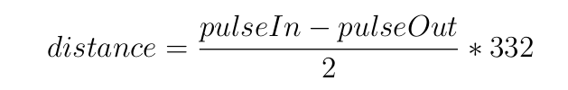

#IN-N-OUT Sensor
This sensor(name inspired by the famous Californian fast food) can detect if a person is entering or exiting from a room.
The results are precise even if it is used in environments with different temperature.
##Development Process

###Ultrasonic sensor
We have used an ultrasonic sensor to measure the distance from the sensor, and the person that is going through the door.
The ultrasonic sensor measures the distance by emitting a pulse of ultrasonic sound, when the pulse hit an object it reflects the sound that travels back to the sensor.
We have realized a program in python, that measures the time between when we send the signal to when we receive back the pulse, and since the speed of sound in air is approx 332 m/s, with this formula we can find out the distance.

A pulse in the trigger pin is needed to activate the sensor, we have checked the [documentation](https://www.velleman.eu/downloads/29/vma306_a4v01.pdf) and find out that a pulse of 10μs  is needed to start the measurement.
When the signal is reflected a 5V signal is sent to the ECHO pin, since we are receiving the signal with a raspberry pi, and the GPIO pins of the raspberry should receive input at 3.3V.
We need to use a voltage dividers.

So we can use for R1 = 1KΩ and for R2 = 2KΩ.
For this part we have followed this [tutorial](https://www.circuitbasics.com/how-to-set-up-an-ultrasonic-range-finder-on-an-arduino) and [this one](https://thepihut.com/blogs/raspberry-pi-tutorials/hc-sr04-ultrasonic-range-sensor-on-the-raspberry-pi)

###DH11
We have decided to add a humidity and temperature sensor to have a more precise measure of the speed of sound.
We can calculate the speed of sound as

    S = 331.4 + (0.606 * T) + (0.0124 * H)
where:

    S = speed of sound in m/s 
    331.4 =  speed of sound (m/s) at 0°C 0% humidity
    T     =  Temperature 
    H     =  Relative humidity
To read the temperature from the sensor, we are using the raspberry pi and, we have realized a python program that is using the library [CircuitPython](https://circuitpython.readthedocs.io/projects/dht/en/latest/).
To realize this part we have followed the official documentation.
###Final program
We have decided to realize a class that represents the object Ultrasonic sensor, where all the constant that I have read in the datasheet are defined and with all the method needed to use the sensor.

*  The init method to initialise the sensor with the correct pin
*  A static method that calculates the sound speed from the temperature and humidity value
*  A method to calculate the distance, in case the distance is not between the range 0--450 cm (detection distance defined in the documentation) an exception is raised
*  A method that is able to understand if the object is moving in the direction of the sensor or if is moving away from the sensor

In the main method after initializing an object for the DH11 and the Ultrasonic sensor, we measure the humidity and temperature, if we catch an error we use a default value.
The method to understand the direction is called and based on that we can send a different MQTT message, that will trigger different automation on Home Assistant.

